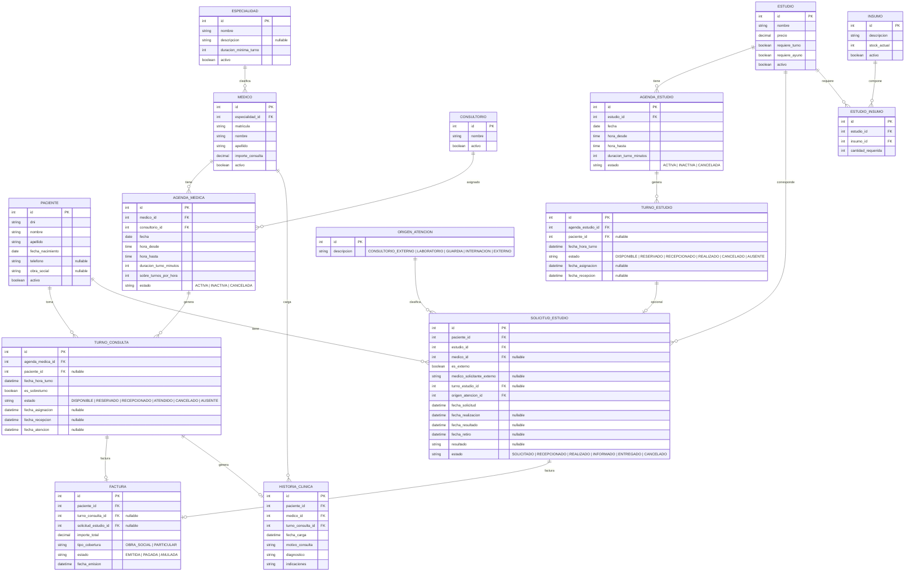

```mermaid
erDiagram
    ESPECIALIDAD {
        int id PK
        string nombre
        string descripcion "nullable"
        int duracion_minima_turno
        boolean activo
    }

    MEDICO {
        int id PK
        int especialidad_id FK
        string matricula
        string nombre
        string apellido
        decimal importe_consulta
        boolean activo
    }

    PACIENTE {
        int id PK
        string dni
        string nombre
        string apellido
        date fecha_nacimiento
        string telefono "nullable"
        string obra_social "nullable"
        boolean activo
    }

    CONSULTORIO {
        int id PK
        string nombre
        boolean activo
    }

    AGENDA_MEDICA {
        int id PK
        int medico_id FK
        int consultorio_id FK
        date fecha
        time hora_desde
        time hora_hasta
        int duracion_turno_minutos
        int sobre_turnos_por_hora
        string estado "ACTIVA | INACTIVA | CANCELADA"
    }

    TURNO_CONSULTA {
        int id PK
        int agenda_medica_id FK
        int paciente_id FK "nullable"
        datetime fecha_hora_turno
        boolean es_sobreturno
        string estado "DISPONIBLE | RESERVADO | RECEPCIONADO | ATENDIDO | CANCELADO | AUSENTE"
        datetime fecha_asignacion "nullable"
        datetime fecha_recepcion "nullable"
        datetime fecha_atencion "nullable"
    }

    FACTURA {
        int id PK
        int paciente_id FK
        int turno_consulta_id FK "nullable"
        int solicitud_estudio_id FK "nullable"
        decimal importe_total
        string tipo_cobertura "OBRA_SOCIAL | PARTICULAR"
        string estado "EMITIDA | PAGADA | ANULADA"
        datetime fecha_emision
    }

    HISTORIA_CLINICA {
        int id PK
        int paciente_id FK
        int medico_id FK
        int turno_consulta_id FK
        datetime fecha_carga
        string motivo_consulta
        string diagnostico
        string indicaciones
    }

    ESTUDIO {
        int id PK
        string nombre
        decimal precio
        boolean requiere_turno
        boolean requiere_ayuno
        boolean activo
    }

    AGENDA_ESTUDIO {
        int id PK
        int estudio_id FK
        date fecha
        time hora_desde
        time hora_hasta
        int duracion_turno_minutos
        string estado "ACTIVA | INACTIVA | CANCELADA"
    }

    TURNO_ESTUDIO {
        int id PK
        int agenda_estudio_id FK
        int paciente_id FK "nullable"
        datetime fecha_hora_turno
        string estado "DISPONIBLE | RESERVADO | RECEPCIONADO | REALIZADO | CANCELADO | AUSENTE"
        datetime fecha_asignacion "nullable"
        datetime fecha_recepcion "nullable"
    }

    ORIGEN_ATENCION {
        int id PK
        string descripcion "CONSULTORIO_EXTERNO | LABORATORIO | GUARDIA | INTERNACION | EXTERNO"
    }

    SOLICITUD_ESTUDIO {
        int id PK
        int paciente_id FK
        int estudio_id FK
        int medico_id FK "nullable"
        boolean es_externo
        string medico_solicitante_externo "nullable"
        int turno_estudio_id FK "nullable"
        int origen_atencion_id FK
        datetime fecha_solicitud
        datetime fecha_realizacion "nullable"
        datetime fecha_resultado "nullable"
        datetime fecha_retiro "nullable"
        string resultado "nullable"
        string estado "SOLICITADO | RECEPCIONADO | REALIZADO | INFORMADO | ENTREGADO | CANCELADO"
    }

    INSUMO {
        int id PK
        string descripcion
        int stock_actual
        boolean activo
    }

    ESTUDIO_INSUMO {
        int id PK
        int estudio_id FK
        int insumo_id FK
        int cantidad_requerida
    }

    ESPECIALIDAD ||--o{ MEDICO : clasifica
    MEDICO ||--o{ AGENDA_MEDICA : tiene
    CONSULTORIO ||--o{ AGENDA_MEDICA : asignado
    AGENDA_MEDICA ||--o{ TURNO_CONSULTA : genera
    PACIENTE ||--o{ TURNO_CONSULTA : toma

    TURNO_CONSULTA ||--o| FACTURA : factura
    SOLICITUD_ESTUDIO ||--o| FACTURA : factura

    TURNO_CONSULTA ||--o| HISTORIA_CLINICA : genera
    MEDICO ||--o{ HISTORIA_CLINICA : carga

    ESTUDIO ||--o{ AGENDA_ESTUDIO : tiene
    AGENDA_ESTUDIO ||--o{ TURNO_ESTUDIO : genera
    TURNO_ESTUDIO ||--o| SOLICITUD_ESTUDIO : opcional

    PACIENTE ||--o{ SOLICITUD_ESTUDIO : tiene
    ESTUDIO ||--o{ SOLICITUD_ESTUDIO : corresponde
    ORIGEN_ATENCION ||--o{ SOLICITUD_ESTUDIO : clasifica

    ESTUDIO ||--o{ ESTUDIO_INSUMO : requiere
    INSUMO ||--o{ ESTUDIO_INSUMO : compone
```